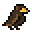
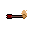

# ScanQuest

**ScanQuest** is a treasure hunt game for android devices, that collects items by scanning the correspondent NFC tags, receiving a pre-determined number of experience for each item scanned.
This items can also be exchanged with other users, each player receiving half of the item experience.

Made for the Final Exam of the module Cross Device Interaction during Winter semester in the Technische Hochschule
Brandenburg.

Authors: [André Ferreira](https://github.com/andr3w10) and [Diogo Correia](https://github.com/drcor)

Date: 29.01.2025

## Build

Instructions for Windows, MacOS and Linux.

1. Follow the instructions to install [Flutter](https://docs.flutter.dev/get-started/install) in Android Studio, Visual Studio Code or IntelliJ IDEA
2. Open the project with the IDE where you installed **Flutter**
3. Run `flutter pub get` to install all dependencies of the project
4. Select the device where you want the app to be installed
5. Press **Run** or execute `flutter run`

## Documentation

More documentation about code can be found in the folder `doc/api`.

## Sources

### Fonts

The fonts were obtained from Google Fonts

- [Rowdies](https://fonts.google.com/specimen/Rowdies) \([see license](fonts/Rowdies/OFL.txt)\)
- [Sour Gummy](https://fonts.google.com/specimen/Sour+Gummy) \([see license](fonts/Sour_Gummy/OFL.txt)\)

### Icons

Hand made by [André Ferreira](https://github.com/andr3w10) using [Aseprite](https://www.aseprite.org/).

### Images

Hand made by [André Ferreira](https://github.com/andr3w10) using [Aseprite](https://www.aseprite.org/).

 Arrow with 3xp

 Basic Sword with 2xp

 Berry with 4xp

 Cat with 7xp

 Chameleon with 12xp

 Chicken Leg with 3xp

 Falcon with 5xp

 Fire Arrow with 6xp

 Fox with 10xp

 Goblin with 15xp

 Skeleton with 8xp

### External libraries

- [flutter\_p2p\_connection: 2.1.1](https://pub.dev/packages/flutter_p2p_connection)
- [nfc\_manager: 3.5.0](https://pub.dev/packages/nfc_manager)
- [path: 1.9.0](https://pub.dev/packages/path)
- [permission_handler: 11.3.1](https://pub.dev/packages/permission_handler)
- [provider: 6.1.2](https://pub.dev/packages/provider)
- [sqflite: 2.4.1](https://pub.dev/packages/sqflite)

### Tutorials & Code-Snippets

- [flutter\_p2p\_connection code example](https://github.com/ugo-studio/flutter_p2p_connection/blob/main/example/lib/main.dart)
- [nfc\_manager code example](https://pub.dev/packages/nfc_manager/example)
- [provider code example](https://pub.dev/packages/provider/example)
